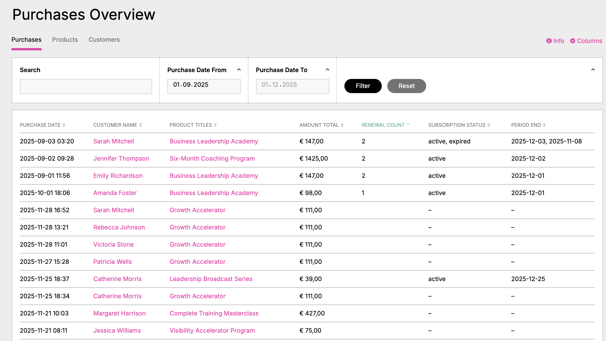
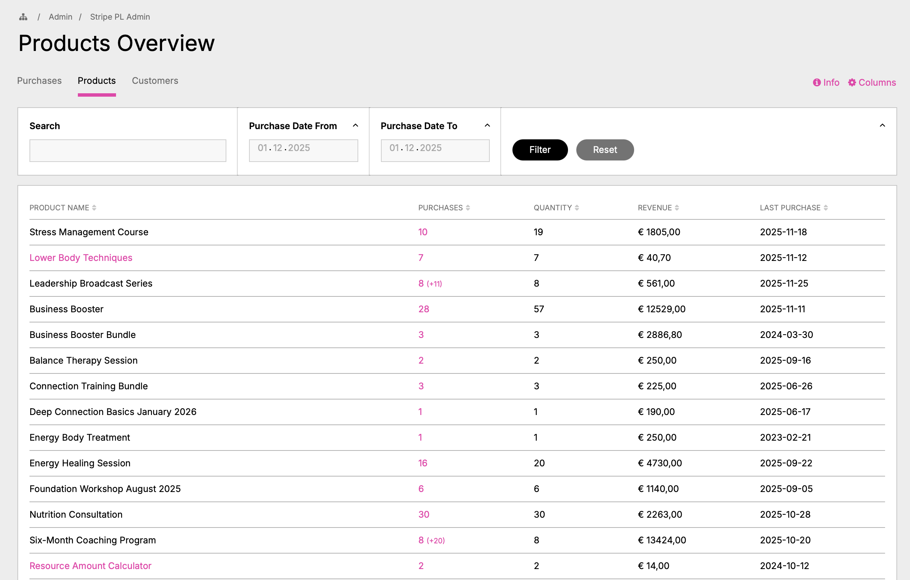
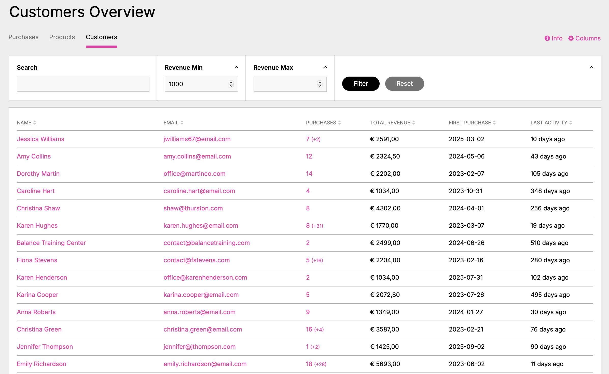
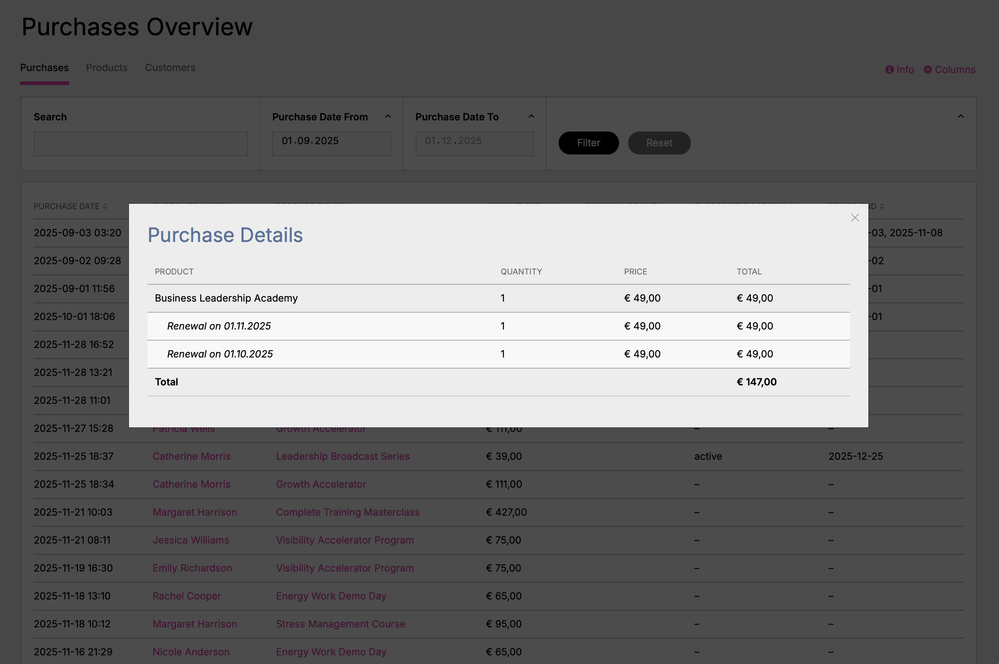
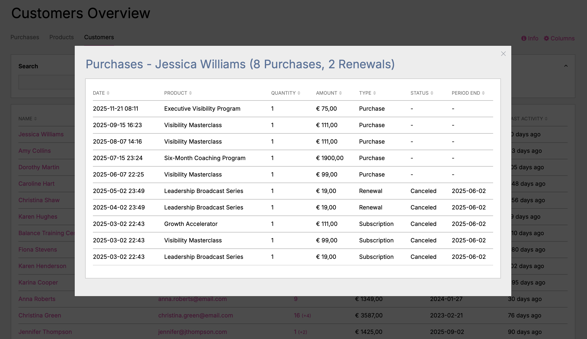

# Stripe Payment Links Admin (StripePlAdmin)

A ProcessWire module that provides a comprehensive admin interface for viewing and analyzing customer purchases from Stripe Payment Links in three different perspectives: Purchases, Products, and Customers.

## Why This Module Was Built

Customers with multiple active Stripe accounts wanted a better, more complete overview and evaluation capabilities across all accounts, which is not possible on the Stripe web platform. This module fills that gap by centralizing purchase data, providing advanced filtering and reporting features, and offering customizable views to meet specific business needs.

## Screenshots

### Purchases Tab

*Transaction history with customer information, subscription status, and renewal tracking. Filterable by date ranges, products, amounts, and more. Customer names and product titles are clickable for detailed views.*

### Products Tab

*Aggregated product performance metrics showing total purchases, revenue, quantities, and renewal counts per product. Product names are clickable and display all purchases of that product in a modal.*

### Customers Tab

*Customer lifetime value analysis with revenue filter (min. €1000). Shows total purchases, revenue, first purchase date, and last activity per customer. Click on names or purchase count to view detailed purchase history.*

### Purchase Details Modal

*Interactive modal showing complete purchase details: original purchase plus all renewals with dates and amounts. Automatic calculation of total revenue. Opened by clicking on product titles.*

### Customer Purchases Modal

*Complete purchase history for a customer showing 8 purchases and 2 renewals. Displays all products, amounts, types (Purchase/Renewal/Subscription), status, and period end dates. Sortable and filterable.*

## What It Does

This module displays Stripe purchase data stored by the `StripePaymentLinks` module in three configurable views:

- **Purchases Tab**: Transaction history with customer and payment details
- **Products Tab**: Aggregated product performance and revenue metrics
- **Customers Tab**: Customer lifetime value and purchase behavior analysis

Each view offers:
- Configurable columns and filters
- Boolean search (AND/OR operators, quoted phrases)
- Date range filtering (Purchase Date, Period End, Last Renewal)
- Interactive modals for detailed information
- CSV export functionality
- Statistical totals and summaries

## Requirements

- ProcessWire 3.x or higher
- `StripePaymentLinks` module (required dependency)
- PHP 7.4 or higher

## Installation

1. Copy the `StripePlAdmin` folder to `/site/modules/`
2. In ProcessWire admin: **Modules > Refresh**
3. Find "Stripe PL Admin" and click **Install**
4. Access at `/processwire/stripe-pl-admin/`

## Configuration

Navigate to **Admin > Setup > Modules > Configure > Stripe PL Admin**:

- **Purchases/Products/Customers Columns**: Select which columns to display
- **Purchases/Products/Customers Filters**: Enable filters for each view
- **Items Per Page**: Set pagination (default: 25, max: 1000)

## Usage Examples

### Example 1: Finding High-Value Customers

1. Navigate to the **Customers** tab
2. Enable the "Total Revenue" filter
3. Set minimum revenue to €1000
4. Sort by "Total Revenue" (descending)
5. Review the list of your most valuable customers
6. Click on a customer name to see their complete purchase history

### Example 2: Analyzing Product Performance

1. Go to the **Products** tab
2. Use the "Purchase Period" filter to select the last quarter
3. Sort by "Revenue" to see top-performing products
4. Click on a product row to see detailed purchase information with filtering
5. Export the filtered data for reporting

### Example 3: Finding Subscriptions Ending This Month

1. In the **Purchases** tab, enable the "Period End" filter
2. Set date range to current month (e.g., 01.12.2025 - 31.12.2025)
3. The filter automatically excludes non-subscription purchases
4. Sort by "Period End" to see which subscriptions end first
5. Click on customer names to see their full purchase history

### Example 4: Advanced Search Examples

Use the search functionality with boolean operators:

- **AND Search**: `john +smith` or `john AND smith` - finds purchases with both terms
- **OR Search**: `john jane` or `john OR smith` - finds purchases with either term
- **Exact Phrase**: `"John Smith"` - finds exact phrase match
- **Combined**: `"Premium Plan" +active` - finds "Premium Plan" that also contains "active"

### Example 5: Revenue Analysis with Renewals

1. Navigate to **Purchases** tab
2. Add "Amount Total" and "Renewal Count" columns
3. Filter by date range for your analysis period
4. Click on product titles to see purchase details modal showing:
   - Original purchase amount
   - All renewal dates and amounts
   - Total revenue per purchase (original + all renewals)
5. Export for financial reporting

### Example 6: Finding Inactive Customers

1. Go to the **Customers** tab
2. Add "Last Activity" column
3. Filter by "Last Activity" date range (e.g., more than 6 months ago)
4. Sort by "Total Revenue" to prioritize re-engagement efforts
5. Export the list for your marketing team

## Key Features

**Data Views:**
- Three perspectives: Purchases, Products, Customers
- Configurable columns per view
- Sortable by any column

**Filtering & Search:**
- Boolean search (AND/OR, quoted phrases, + prefix)
- Date range filters (Purchase Date, Period End, Last Renewal)
- Number range filters (Amount, Revenue, Quantity)
- Product multi-select filter
- Smart exclusion (e.g., Period End filter automatically excludes non-subscriptions)

**Interactive Elements:**
- Click product titles → Purchase Details Modal
- Click product names → Product Purchases Modal
- Click customer names → Customer Purchases Modal
- All modals support filtering and sorting

**Data Export:**
- CSV export of filtered data
- Includes all visible columns
- Respects active filters

**Subscription Tracking:**
- Subscription status display
- Period end dates
- Renewal count and history
- Last renewal tracking

## How It Works

This module is a **viewing and analysis tool** that reads purchase data stored by the `StripePaymentLinks` module:

1. `StripePaymentLinks` module handles Stripe API integration via webhooks
2. Purchase data is stored in ProcessWire user fields (`spl_purchases`)
3. This module reads that data and provides advanced viewing/analysis capabilities

**Important**: This module does not make direct Stripe API calls. Data is as current as the last webhook sync from Stripe.

## Version

1.1.0 (December 2025)

## Author

**[frameless Media](https://frameless.at/en)**

## License

MIT License

---

**Framework**: [ProcessWire](https://processwire.com)
**Stripe Integration**: [Stripe Payment Links](https://stripe.com)
